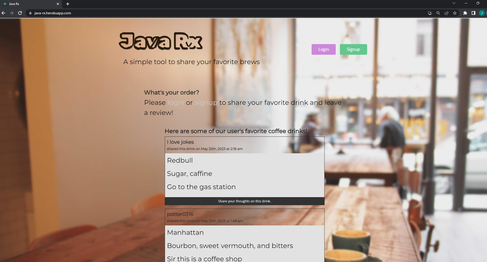

# Java-Rx (Java 'Script)

## Description

This is an interactive MERN Stack Single-Page Application that is the culmination of our 6 month coding bootcamp course. Java-Rx uses a MongoDB back end, a GraphQL API, Express.js and Node.js server with a React front end and implements user authenticatoin with JWT tobuild out the full user focused platform. This application is a social media platform that is intended to revolve around coffee. Users can visit this page and get inspiration for new drink recipes from other user's posts. Eventually this application will allow users to search a database of existing coffee drinks, complete with a list of ingredients, instrutions on how to make the delicious beverage, as well as a photo of the finished product. The user will also be able to upload their own drink including a photo of their beverage.

## Table of contents

- [Installation](#installation)
- [Usage](#usage)
- [Contributions](#contributions)
- [Tests](#tests)
- [License](#license)
- [Questions](#questions)

## Installation

This is a fully deployed application hosted on Heroku. No installation is required at this time.

## Usage

A user will be able to simply visit our deployed applicatoin at Java-Rx.herokuapp.com and scroll throug existing posts. If they want to add their own post they will need to either log in or sign up for an account. They can also leave comments on other posts to share feedback an other ideas.

---

---

## Contributions

This project was coded by Gabriella Swenson, William Wood, Sean Gibbons, Michael Potter, and Jonah Kane. This would also not be possible without the hours of help from the UofM bootcamp instructional staff, namely Konner Hartman and Jack Linhart who helped us through so many bugs and errors.

## Tests

N/A.

## License

MIT License

(https://opensource.org/licenses/MIT)

A short and simple permissive license with conditions only requiring preservation of copyright and license notices. Licensed works, modifications, and larger works may be distributed under different terms and without source code.

## Questions

If you have questions on this project you can find us on Github at https://github.com/gabriellaswenson, https://github.com/woodwilliam, https://github.com/seangibbons730, https://github.com/potter0316, and https://github.com/JonahKane.
